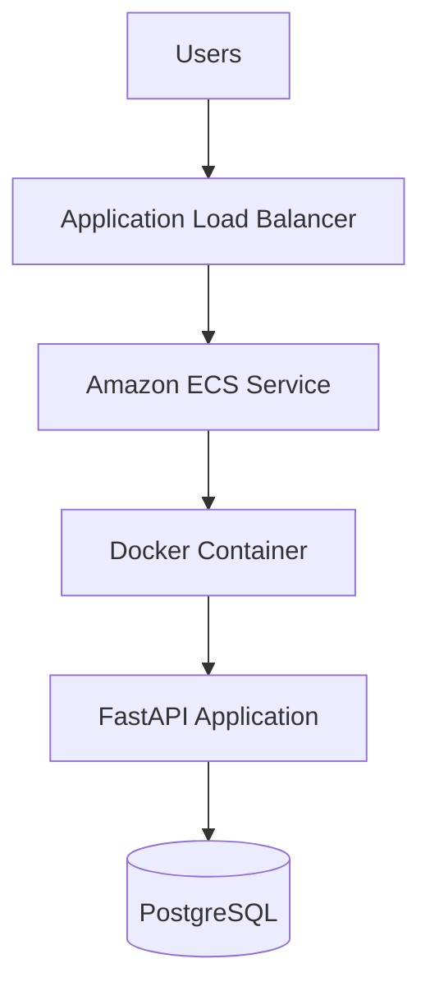

# Task Manager API

Task Manager API is a production-oriented FastAPI application for creating, updating, completing, and deleting tasks. It includes a responsive Bootstrap UI, PostgreSQL persistence, Docker-based local development, and an ECS/Fargate deployment path with GitHub Actions.

## Project Overview

- Backend: Python, FastAPI, SQLAlchemy, PostgreSQL, Pydantic
- Frontend: HTML, CSS, Vanilla JavaScript, Bootstrap
- Deployment: Docker, Docker Compose, GitHub Actions, Amazon ECR, Amazon ECS Fargate, Application Load Balancer
- Architecture: Clean, modular layout with API, service, model, schema, and database layers

## Architecture Diagram



## Features

- Home page for managing tasks
- Create, view, update, delete, and complete tasks
- Validation with Pydantic and FastAPI
- Health endpoint for container and load balancer checks
- Responsive UI with Bootstrap
- Structured logging
- Environment-variable configuration
- Docker Compose for local development

## API Documentation

Base URL: `http://localhost:8000`

### Endpoints

- `GET /health`
- `GET /tasks`
- `GET /tasks/{id}`
- `POST /tasks`
- `PUT /tasks/{id}`
- `DELETE /tasks/{id}`
- `PATCH /tasks/{id}/complete`

### Task Schema

- `id`
- `title`
- `description`
- `priority`
- `status`
- `created_at`

### Example Request

```bash
curl -X POST http://localhost:8000/tasks \
  -H "Content-Type: application/json" \
  -d '{
    "title": "Ship Task Manager",
    "description": "Deploy the app to ECS",
    "priority": "high"
  }'
```

## Folder Structure

```text
task-manager/
├── app/
│   ├── api/
│   ├── models/
│   ├── schemas/
│   ├── database/
│   ├── services/
│   ├── static/
│   ├── templates/
│   ├── main.py
│   └── config.py
├── tests/
├── deploy/
├── .github/workflows/
├── Dockerfile
├── docker-compose.yml
├── requirements.txt
├── .gitignore
├── .dockerignore
└── README.md
```

## Local Setup

### Prerequisites

- Docker
- Docker Compose

### Run Locally

```bash
docker compose up --build
```

Open:

- UI: `http://localhost:8000`
- Health: `http://localhost:8000/health`
- OpenAPI: `http://localhost:8000/docs`

## Docker Setup

The project uses a multi-stage Dockerfile:

- Builder stage installs dependencies into wheels
- Runtime stage uses a slim Python base image
- Container runs as a non-root user
- Healthcheck calls `/health`
- Configuration is driven by environment variables

### Example Variables

```bash
APP_NAME=Task Manager API
DEBUG=false
LOG_LEVEL=INFO
DATABASE_URL=postgresql+psycopg://taskuser:taskpassword@db:5432/taskmanager
ALLOWED_ORIGINS=http://localhost:8000
HOST=0.0.0.0
PORT=8000
```

## GitHub Actions

The workflow at `.github/workflows/ci-cd.yml` runs automatically on push to `main`.

Pipeline stages:

1. Lint with `ruff`
2. Run tests with `pytest`
3. Build Docker image
4. Push image to Amazon ECR
5. Deploy the updated task definition to Amazon ECS

### Required GitHub Secrets

- `AWS_REGION`
- `AWS_ROLE_TO_ASSUME`
- `ECR_REPOSITORY`
- `ECS_CLUSTER`
- `ECS_SERVICE`

### AWS Inputs Used by the Deployment

- AWS account: `810448722017`
- Example ECR repository: `task-manager-api`
- Example ECS service name: `task-manager-api-service`

## AWS Deployment

This project is designed to run on:

```text
Users
↓
Application Load Balancer
↓
Amazon ECS Service
↓
Docker Container
↓
FastAPI Application
↓
PostgreSQL
```

### Required AWS Resources

- Amazon ECR repository
- ECS cluster
- ECS Fargate service
- ECS task execution role
- ECS task role
- Application Load Balancer
- Target group for container port `8000`
- CloudWatch Logs group
- PostgreSQL database accessible from ECS tasks
- AWS SSM parameters for secrets

### ECS Task Definition

The example task definition is in `deploy/ecs-task-definition.json`.

Update these values before deployment if needed:

- `executionRoleArn`
- `taskRoleArn`
- `awslogs-region`
- ECR image URI
- SSM parameter ARNs

### Suggested Environment Variables in AWS

Store these in AWS Systems Manager Parameter Store:

- `DATABASE_URL`
- `SECRET_KEY`
- `ALLOWED_ORIGINS`

### Load Balancer Health Check

- Path: `/health`
- Success codes: `200`
- Container port: `8000`

## Validation and Error Handling

- Request validation is handled by Pydantic
- Missing resources return `404`
- Unexpected errors are logged and return safe JSON responses

## Logging

The application writes structured logs to stdout, which is compatible with Docker, ECS, and CloudWatch Logs.

## Future Improvements

- Add Alembic migrations
- Add authentication and authorization
- Add pagination and filtering
- Add audit fields such as `updated_at` and `deleted_at`
- Add Terraform or CloudFormation for full AWS infrastructure provisioning
- Add observability with OpenTelemetry
- Add unit tests for the service layer

## Testing

Run tests locally:

```bash
pytest -q
```

Run linting:

```bash
ruff check .
```
